# Knowledge charter

## Mission

Build a durable, source-linked mental model of current CMSSW, with enough broad
framework knowledge to contribute safely and a deep specialization in Phase-II
timing for BTL, ETL, and HGCAL.

The immediate purpose is understanding the information already present in
CMSSW—not designing a new machine-learning tagger. Later design work should be
grounded in a precise account of what timing information exists, what it means,
where it changes, what survives persistence, and what it costs.

## Primary questions

For each BTL, ETL, and HGCAL timing quantity, the knowledge base should answer:

1. Where is it first produced, and from which detector or simulated signal?
2. What physical or algorithmic time does it represent?
3. What are its units, reference point, uncertainty, and invalid-value
   convention?
4. Which modules calibrate, smear, combine, reinterpret, or discard it?
5. Which EDM products contain it at SIM, DIGI, RECO, AOD, MiniAOD, and NanoAOD?
6. Where does the information disappear, and is that loss intentional?
7. How could a new time or PID-related quantity be added and synchronized
   without duplicating information or exceeding CPU and storage budgets?

The first physics-facing applications are forward jets, track–calorimeter
timing, heavy-flavour tagging, strange-jet tagging, and charged-hadron
π/K information for analysis. They guide which information matters; they do
not replace the reconstruction study.

## Scope

The primary source is current CMSSW `master`. The initial end-to-end trace is:

```mermaid
flowchart LR
    truth[Simulation truth] --> sim[Detector simulation]
    sim --> digi[Digitization]
    digi --> local[Local reconstruction]
    local --> cal[Calibration and alignment]
    cal --> objects[Tracks, clusters, tracksters]
    objects --> pf[Particle flow and candidates]
    pf --> persist[Persistence and analysis]
```

The knowledge base also covers the CMSSW foundations needed to understand that
trace: framework execution, Python configuration, the event data model,
provenance, EventSetup and conditions, geometry, heterogeneous data formats,
validation, and release workflows.

Out of scope for the first phase:

- proposing or training a new tagger;
- treating an ML input list as a substitute for tracing reconstruction;
- assuming differently named time fields share a physical reference;
- documenting historical releases before the current chain is understood.

## Learning and reference design

Pages are layered so the same subject can serve both learning and code lookup:

- **Quick model** — the physical idea and one diagram;
- **Working model** — products, producers, configuration, and data flow;
- **Source audit** — pinned symbols, exact behavior, persistence, caveats, and
  open questions.

The curriculum revisits the same timing chain in progressively greater depth.
This spiral structure preserves the full-system picture while individual
algorithms are studied.

## Evidence standard

Technical claims should distinguish three levels:

- **Verified** — directly supported by pinned source or configuration;
- **Inferred** — follows from multiple verified observations but still needs a
  runtime check or domain confirmation;
- **Open** — ambiguity or missing coverage is stated explicitly.

Every source-audit page records the exact CMSSW commit. Official CMS detector
documents explain design intent, but checked-out source and configuration are
authoritative for current software behavior.

## Definition of useful completion

A subsystem trace is useful when a reader can name the product at each stage,
follow it to the next producer, explain its time reference and uncertainty,
identify output-tier boundaries, and point to the exact code that would need to
change. A physics-facing quantity is not considered available until its path to
the intended analysis data tier is verified.
