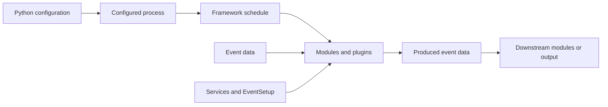

# The CMSSW big picture

## Learning objectives

After this chapter, you should be able to:

- Explain why CMSSW separates framework mechanics, data formats,
  configuration, and physics algorithms.
- Recognize the common layout of a CMSSW package.
- Choose a useful starting point for tracing a processing workflow.

## A working mental model

At a high level, a configured process asks the framework to schedule modules.
Those modules consume and produce typed event data, while services and
EventSetup records provide supporting state.

This diagram is deliberately incomplete. It is an orientation map that later
chapters will refine with concrete framework symbols and verified call paths.

## Major codebase roles

| Role | Representative area | Questions it answers |
| --- | --- | --- |
| Framework mechanics | `FWCore` | How are jobs, schedules, modules, services, and events managed? |
| Data contracts | `DataFormats` | What typed objects move between processing modules? |
| Process assembly | `Configuration` | How are standard sequences and processing scenarios constructed? |
| Detector model | `Geometry`, `CondFormats`, `CondCore` | What geometry and time-dependent state do algorithms use? |
| Algorithms | `Reco*`, `Sim*`, `L1Trigger`, `HLTrigger` | How are physics and detector transformations implemented? |
| Quality assurance | `DQM*`, `Validation` | How is output monitored and validated? |

## Common package landmarks

CMSSW packages often expose stable C++ interfaces under `interface/`, place
implementations under `src/`, register framework plugins under `plugins/`, and
provide Python configuration under `python/`. Tests, data files, and standalone
utilities appear where the package needs them.

Treat these as conventions, not guarantees. When tracing behavior, start from a
known configuration or test, identify the configured plugin, then follow its
consumes/produces relationships through the event data.

## Review questions

1. Which parts of a CMSSW workflow are decided in Python, and which occur in
   compiled C++?
2. Why is a data product often a more useful navigation anchor than a directory?
3. Where would you look for an executable example of an unfamiliar package?

## Verification status

This introductory model still needs source anchors to the framework lifecycle
and a verified end-to-end example from the checked-out CMSSW revision.
