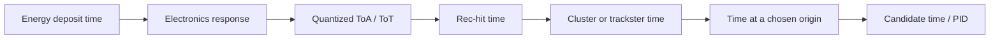
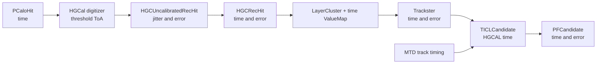
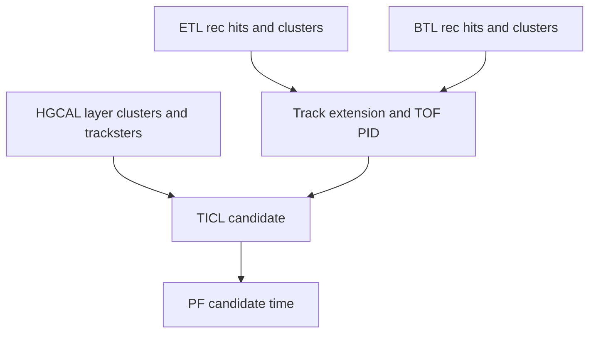

# Timing in CMSSW

!!! info "Verification snapshot"

    This page describes CMSSW `master` at commit
    [`f1ac1dbe`](https://github.com/cms-sw/cmssw/commit/f1ac1dbe1f36762b14843b1fb906971de43a1044),
    checked on 17 August 2026. Follow the source links before applying a detail
    to another revision.

## Quick model

CMSSW does not carry one universal detector timestamp. It carries a sequence of
measurements and estimates:

Each arrow can change both the numerical value and its meaning. A useful timing
quantity therefore needs at least four labels: detector object, estimator,
reference point, and uncertainty.

## Working model: the two reconstruction paths

### MTD: BTL and ETL

```mermaid
flowchart LR
    P[PSimHit<br/>tof] --> DS[BTL/ETL device simulation]
    DS --> ES[Electronics simulation<br/>threshold and smearing]
    ES --> DG[FTL digi<br/>ToA; ETL also ToT]
    DG --> UR[FTLUncalibratedRecHit<br/>amplitude, time, error]
    UR --> RH[FTLRecHit<br/>energy, time, error]
    RH --> CL[FTLCluster<br/>per-hit and cluster time]
    CL --> TX[TrackExtenderWithMTD]
    TX --> VM[ValueMaps<br/>tmtd, path, t0, beta, TOF]
    VM --> PID[TOFPIDProducer<br/>π/K/p probabilities]
```

At local reconstruction, BTL combines two sensor sides and can infer a
longitudinal position from their time difference. ETL uses its single-side
measurement. The current local calibration subtracts a BTL half-bar propagation
term; the ETL branch applies no additional correction in that implementation.
Track extension then associates timing hits to a track, stores measured MTD time
and path length, and derives beamline time and mass-hypothesis time of flight.

### HGCAL and TICL

HGCAL timing is reconstructed first per hit, then aggregated for layer clusters
and tracksters. TICL can correct a trackster-derived time toward an origin using
path length and β, and can combine it with MTD `t0`; it also retains a separate
measured MTD time field on `TICLCandidate`.

## Where the paths meet

The two chains converge at track and candidate reconstruction, not at a single
detector-wide rec-hit calibration:

This makes track–calorimeter synchronization a chain-level question. Matching
two fields named `time()` is insufficient: the path correction, mass
hypothesis, vertex time, detector offsets, and uncertainty model must also
match.

## First verified conclusions

1. **Raw timing detail is richer than downstream timing.** BTL starts with two
   ToA values; ETL has ToA and ToT; uncalibrated MTD hits can hold two amplitudes
   and two times. Later products deliberately aggregate these measurements.
2. **MTD track products expose both measurements and interpretations.** The
   track extender publishes `tmtd`, its uncertainty, path length, beamline
   `t0`, β, and π/K/p time-of-flight hypotheses as `ValueMap`s.
3. **HGCAL timing has a configuration-sensitive reference.** The default
   uncalibrated-hit configuration removes the configured digitizer `tofDelay`
   but does not take the branch that additionally subtracts straight-line
   distance to the detector center. Comments elsewhere describe a
   vertex-distance correction, so the operational convention needs a runtime
   validation before it is summarized as a universal physical reference.
4. **Persistence is stage-dependent.** MTD calibrated rec hits and clusters are
   kept in RECO but not by the MTD AOD fragment; MTD track timing maps are kept
   in AOD. HGCAL rec hits and layer-cluster time maps are kept in Phase-II AOD.
   TICL tracksters/candidates/PF outputs are currently listed in RECO content,
   while intermediate MTD SoA data are transient.
5. **MiniAOD and NanoAOD remain an explicit audit item.** No claim that a field
   is analysis-available should be made from RECO/AOD persistence alone.

The exact products, producers, and source anchors are in the
[timing inventory](inventory.md).

## Why this matters for later physics work

Heavy-flavour and strange-jet studies need stable object associations and
well-defined residuals, not merely more floats. Charged-hadron π/K information
likewise depends on path length, momentum, mass hypothesis, detector timing,
and event-time treatment. Preserving those semantics—and the minimum
information needed to recompute them—is the prerequisite for judging storage
and CPU trade-offs.
