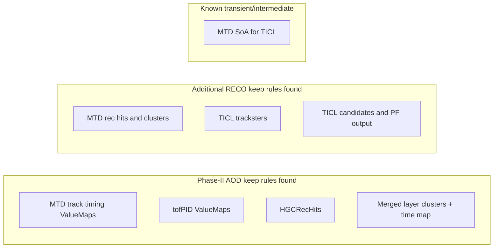

# Timing product and persistence inventory

This is the first static audit of the current chain. “Persisted” below means an
explicit keep rule was found in the named event-content fragment; it does not
imply presence in every workflow or in MiniAOD/NanoAOD.

## MTD: BTL and ETL

| Stage | Product or object | Timing payload | Principal transformation | Persistence found |
| --- | --- | --- | --- | --- |
| SIM input | `PSimHit` | `tof()` | Device simulation groups deposits and keeps threshold-relevant timing | Workflow-dependent SIM input |
| BTL digi | `BTLSample` | two 10-bit ToA fields | Electronics response, threshold crossing, smearing, clock terms, TDC quantization | DIGI/FEVT audit pending |
| ETL digi | `ETLSample` | 11-bit ToA and 11-bit ToT | Threshold time, charge response, smearing, LSB quantization | DIGI/FEVT audit pending |
| Local uncalibrated | `FTLUncalibratedRecHit` | two times, two amplitudes, time error, position estimate | Digi counts converted to ns; time-walk and detector-specific corrections | Kept in MTD FEVT, not MTD RECO/AOD fragment |
| Local calibrated | `FTLRecHit` | time, time error, energy, position | BTL side average or ETL time; energy and time calibration | Kept in MTD RECO, not MTD AOD fragment |
| MTD cluster | `FTLCluster` | per-hit times/errors and cluster time/error | Cluster time is energy-weighted over hits | Kept in MTD RECO, not MTD AOD fragment |
| Track association | `TrackExtenderWithMTD` `ValueMap`s | `tmtd`, `sigmatmtd`, path length, `t0`, `sigmat0`, β, π/K/p TOF and errors, matching diagnostics | Associates MTD hits; combines compatible timing; translates measured time to hypothesis-dependent track quantities | Kept by Phase-II MTD AOD fragment |
| TOF PID | `tofPID` `ValueMap`s | `t0`, safe `t0`, errors, `probPi`, `probK`, `probP` | Uses vertex association and π/K/p mass hypotheses | Phase-II vertex event content keeps `tofPID` maps |
| TICL bridge | `MtdHostCollection` | association, `t0`, `tmtd`, errors, path, β, position, momentum, PID probabilities | Packs track timing maps into a heterogeneous SoA for TICL | Transient intermediate |

### MTD source trail

- BTL and ETL packed digi fields:
  [`BTLSample`](https://github.com/cms-sw/cmssw/blob/f1ac1dbe1f36762b14843b1fb906971de43a1044/DataFormats/FTLDigi/interface/BTLSample.h#L15-L63) and
  [`ETLSample`](https://github.com/cms-sw/cmssw/blob/f1ac1dbe1f36762b14843b1fb906971de43a1044/DataFormats/FTLDigi/interface/ETLSample.h#L15-L75).
- MTD hit and cluster payloads:
  [`FTLUncalibratedRecHit`](https://github.com/cms-sw/cmssw/blob/f1ac1dbe1f36762b14843b1fb906971de43a1044/DataFormats/FTLRecHit/interface/FTLUncalibratedRecHit.h#L20-L76),
  [`FTLRecHit`](https://github.com/cms-sw/cmssw/blob/f1ac1dbe1f36762b14843b1fb906971de43a1044/DataFormats/FTLRecHit/interface/FTLRecHit.h#L40-L108), and
  [`FTLCluster`](https://github.com/cms-sw/cmssw/blob/f1ac1dbe1f36762b14843b1fb906971de43a1044/DataFormats/FTLRecHit/interface/FTLCluster.h#L81-L214).
- ETL digitization starts from sim-hit `tof()` in
  [`MTDDigitizer`](https://github.com/cms-sw/cmssw/blob/f1ac1dbe1f36762b14843b1fb906971de43a1044/SimFastTiming/FastTimingCommon/interface/MTDDigitizer.h#L208-L228),
  retains threshold-relevant hit time in
  [`ETLDeviceSim`](https://github.com/cms-sw/cmssw/blob/f1ac1dbe1f36762b14843b1fb906971de43a1044/SimFastTiming/FastTimingCommon/src/ETLDeviceSim.cc#L77-L155), and
  constructs/quantizes ToA and ToT in
  [`ETLElectronicsSim`](https://github.com/cms-sw/cmssw/blob/f1ac1dbe1f36762b14843b1fb906971de43a1044/SimFastTiming/FastTimingCommon/src/ETLElectronicsSim.cc#L64-L160).
- ETL local reconstruction converts counts using `toaLSBToNS`, applies a
  polynomial time-walk correction, and estimates uncertainty in
  [`ETLUncalibRecHitAlgo`](https://github.com/cms-sw/cmssw/blob/f1ac1dbe1f36762b14843b1fb906971de43a1044/RecoLocalFastTime/FTLCommonAlgos/plugins/ETLUncalibRecHitAlgo.cc#L5-L47).
- BTL local reconstruction treats both ends, applies time-walk correction, and
  derives longitudinal position from their difference in
  [`BTLUncalibRecHitAlgo`](https://github.com/cms-sw/cmssw/blob/f1ac1dbe1f36762b14843b1fb906971de43a1044/RecoLocalFastTime/FTLCommonAlgos/plugins/BTLUncalibRecHitAlgo.cc#L6-L80).
- Calibrated hit construction and current detector branches are in
  [`MTDRecHitAlgo`](https://github.com/cms-sw/cmssw/blob/f1ac1dbe1f36762b14843b1fb906971de43a1044/RecoLocalFastTime/FTLCommonAlgos/plugins/MTDRecHitAlgo.cc#L17-L73);
  [`MTDTimeCalib`](https://github.com/cms-sw/cmssw/blob/f1ac1dbe1f36762b14843b1fb906971de43a1044/RecoLocalFastTime/FTLCommonAlgos/src/MTDTimeCalib.cc#L14-L50)
  subtracts the BTL half-bar propagation term and currently returns no ETL
  correction.
- The local task order is explicit in
  [`RecoLocalFastTime_cff.py`](https://github.com/cms-sw/cmssw/blob/f1ac1dbe1f36762b14843b1fb906971de43a1044/RecoLocalFastTime/Configuration/python/RecoLocalFastTime_cff.py#L3-L12).
- The track extender declares and fills its timing maps in
  [`TrackExtenderWithMTD`](https://github.com/cms-sw/cmssw/blob/f1ac1dbe1f36762b14843b1fb906971de43a1044/RecoMTD/TrackExtender/plugins/TrackExtenderWithMTD.cc#L298-L319) and
  [the map-filling block](https://github.com/cms-sw/cmssw/blob/f1ac1dbe1f36762b14843b1fb906971de43a1044/RecoMTD/TrackExtender/plugins/TrackExtenderWithMTD.cc#L662-L683).
  The measured and hypothesis-derived quantities are assembled
  [later in the same producer](https://github.com/cms-sw/cmssw/blob/f1ac1dbe1f36762b14843b1fb906971de43a1044/RecoMTD/TrackExtender/plugins/TrackExtenderWithMTD.cc#L790-L857).
- The TOF/PID equations and masses are in
  [`TrackTofPidInfo`](https://github.com/cms-sw/cmssw/blob/f1ac1dbe1f36762b14843b1fb906971de43a1044/RecoMTD/TimingTools/src/TrackTofPidInfo.cc#L19-L135);
  final `ValueMap` production is in
  [`TOFPIDProducer`](https://github.com/cms-sw/cmssw/blob/f1ac1dbe1f36762b14843b1fb906971de43a1044/RecoMTD/TimingIDTools/plugins/TOFPIDProducer.cc#L36-L101).

## HGCAL, TICL, and PF

| Stage | Product or object | Timing payload | Principal transformation | Persistence found |
| --- | --- | --- | --- | --- |
| SIM input | `PCaloHit` | `time()` | Digitizer adds detector-specific `tofDelay`, bins charge, and forms threshold time | Workflow-dependent SIM input |
| HGCAL digi | data frame samples | ToA encoded in sample | Threshold and electronics digitization | DIGI/FEVT audit pending |
| Local uncalibrated | `HGCUncalibratedRecHit` | `jitter`, quantized jitter error | Converts ToA to ns; reference correction depends on `computeLocalTime` | Kept in HGCAL FEVT, not Phase-II AOD fragment |
| Local calibrated | `HGCRecHit` | inherited rec-hit time plus float time error | Calibrates energy; carries time; estimates silicon timing error from S/N | Kept in Phase-II AOD |
| Layer cluster | cluster + `timeLayerCluster` `ValueMap` | time and time error | Inverse-variance inputs plus fixed-size highest-density estimator | Merged clusters and time map kept in Phase-II AOD |
| Trackster | `Trackster` | time/error; boundary time/error | Highest-density cluster-time estimator, or optional local-time weighted estimator with geometry correction | TICL-generated content kept in RECO |
| TICL candidate | `TICLCandidate` | candidate time/error and separate MTD time/error | Corrects trackster time toward origin; can combine with MTD `t0`; records measured MTD time separately | TICL-generated content kept in RECO |
| PF candidate | `PFCandidate` | time and time error | Copies chosen TICL candidate time | TICL PF output kept in RECO |

### HGCAL and TICL source trail

- Uncalibrated and calibrated hit fields:
  [`HGCUncalibratedRecHit`](https://github.com/cms-sw/cmssw/blob/f1ac1dbe1f36762b14843b1fb906971de43a1044/DataFormats/HGCRecHit/interface/HGCUncalibratedRecHit.h#L18-L62) and
  [`HGCRecHit`](https://github.com/cms-sw/cmssw/blob/f1ac1dbe1f36762b14843b1fb906971de43a1044/DataFormats/HGCRecHit/interface/HGCRecHit.h#L71-L129).
- HGCAL digitization reads hit time and forms threshold timing in
  [`HGCDigitizer`](https://github.com/cms-sw/cmssw/blob/f1ac1dbe1f36762b14843b1fb906971de43a1044/SimCalorimetry/HGCalSimProducers/plugins/HGCDigitizer.cc#L437-L460), with the threshold sequence
  [later in the same file](https://github.com/cms-sw/cmssw/blob/f1ac1dbe1f36762b14843b1fb906971de43a1044/SimCalorimetry/HGCalSimProducers/plugins/HGCDigitizer.cc#L560-L620).
  Detector-specific delays are configured in
  [`hgcalDigitizer_cfi.py`](https://github.com/cms-sw/cmssw/blob/f1ac1dbe1f36762b14843b1fb906971de43a1044/SimCalorimetry/HGCalSimProducers/python/hgcalDigitizer_cfi.py#L60-L172).
- The uncalibrated-hit timing branches are visible in
  [`HGCalUncalibRecHitRecWeightsAlgo`](https://github.com/cms-sw/cmssw/blob/f1ac1dbe1f36762b14843b1fb906971de43a1044/RecoLocalCalo/HGCalRecAlgos/interface/HGCalUncalibRecHitRecWeightsAlgo.h#L55-L103).
  The producer default sets `computeLocalTime = true` in
  [`HGCalUncalibRecHitProducer`](https://github.com/cms-sw/cmssw/blob/f1ac1dbe1f36762b14843b1fb906971de43a1044/RecoLocalCalo/HGCalRecProducers/plugins/HGCalUncalibRecHitProducer.cc#L135-L150).
- Calibrated-hit time propagation and uncertainty are in
  [`HGCalRecHitWorkerSimple`](https://github.com/cms-sw/cmssw/blob/f1ac1dbe1f36762b14843b1fb906971de43a1044/RecoLocalCalo/HGCalRecProducers/plugins/HGCalRecHitWorkerSimple.cc#L223-L248).
- Layer-cluster timing selection, weighting, and output are in
  [`HGCalLayerClusterProducer`](https://github.com/cms-sw/cmssw/blob/f1ac1dbe1f36762b14843b1fb906971de43a1044/RecoLocalCalo/HGCalRecProducers/plugins/HGCalLayerClusterProducer.cc#L221-L305).
  The implementation explicitly notes that this timing is presently limited
  to EE/FH rather than BH.
- Trackster timing fields are defined in
  [`Trackster`](https://github.com/cms-sw/cmssw/blob/f1ac1dbe1f36762b14843b1fb906971de43a1044/DataFormats/HGCalReco/interface/Trackster.h#L178-L219),
  with the normal and local timing estimators in
  [`TrackstersPCA`](https://github.com/cms-sw/cmssw/blob/f1ac1dbe1f36762b14843b1fb906971de43a1044/RecoHGCal/TICL/plugins/TrackstersPCA.cc#L251-L330).
- Separate candidate and MTD timing fields are defined by
  [`TICLCandidate`](https://github.com/cms-sw/cmssw/blob/f1ac1dbe1f36762b14843b1fb906971de43a1044/DataFormats/HGCalReco/interface/TICLCandidate.h#L23-L170).
  Candidate time combination is implemented in
  [`TICLCandidateProducer`](https://github.com/cms-sw/cmssw/blob/f1ac1dbe1f36762b14843b1fb906971de43a1044/RecoHGCal/TICL/plugins/TICLCandidateProducer.cc#L517-L588),
  and `PFTICLProducer` transfers it to
  [`PFCandidate`](https://github.com/cms-sw/cmssw/blob/f1ac1dbe1f36762b14843b1fb906971de43a1044/RecoHGCal/TICL/plugins/PFTICLProducer.cc#L124-L150).

## Persistence boundaries found

The direct configuration evidence is:

- [`RecoLocalFastTime_EventContent_cff.py`](https://github.com/cms-sw/cmssw/blob/f1ac1dbe1f36762b14843b1fb906971de43a1044/RecoLocalFastTime/Configuration/python/RecoLocalFastTime_EventContent_cff.py#L1-L24)
  for local MTD products;
- [`RecoMTD_EventContent_cff.py`](https://github.com/cms-sw/cmssw/blob/f1ac1dbe1f36762b14843b1fb906971de43a1044/RecoMTD/Configuration/python/RecoMTD_EventContent_cff.py#L1-L17)
  for track-extender maps and extended tracks;
- [`RecoVertex_EventContent_cff.py`](https://github.com/cms-sw/cmssw/blob/f1ac1dbe1f36762b14843b1fb906971de43a1044/RecoVertex/Configuration/python/RecoVertex_EventContent_cff.py#L1-L25)
  for Phase-II `tofPID` maps;
- [`RecoLocalCalo_EventContent_cff.py`](https://github.com/cms-sw/cmssw/blob/f1ac1dbe1f36762b14843b1fb906971de43a1044/RecoLocalCalo/Configuration/python/RecoLocalCalo_EventContent_cff.py#L20-L78)
  for HGCAL hit and layer-cluster timing;
- [the generated TICL event-content catalog](https://github.com/cms-sw/cmssw/blob/f1ac1dbe1f36762b14843b1fb906971de43a1044/RecoTICL/Configuration/python/event_content.py#L1-L34)
  and
  [`ticlEventContent_cff.py`](https://github.com/cms-sw/cmssw/blob/f1ac1dbe1f36762b14843b1fb906971de43a1044/RecoTICL/Configuration/python/ticlEventContent_cff.py#L61-L80).

## Time-reference map

| Quantity | Reference presently established from source | Status |
| --- | --- | --- |
| `PSimHit::tof()` / `PCaloHit::time()` | Detector simulation hit time | Verified as digitizer input; upstream Geant convention still to document |
| BTL/ETL digi ToA | Electronics threshold time encoded in TDC units | Verified; full clock/reference decomposition needs a dedicated chapter |
| MTD rec-hit time | Local digi-derived time after time-walk and current calibration | Verified; BTL half-bar term is explicit, ETL extra calibration is currently null |
| `tmtd` | Associated measured MTD time at the hit(s) | Verified |
| track `t0` | `tmtd` translated toward the beamline using path and a mass hypothesis | Verified; pion hypothesis is the base track-extender quantity |
| HGC uncalibrated `jitter` | ToA converted to ns with configured delay subtraction; optional geometric subtraction depends on `computeLocalTime` | Verified code branches; physical naming/convention requires runtime validation |
| layer-cluster time | Robust estimator over selected timed rec hits | Verified; input reference is inherited from rec hits |
| trackster time | Robust LC estimator, or optional local estimator corrected between LC positions and barycenter | Verified |
| TICL candidate time | Trackster-derived time shifted toward origin and optionally combined with MTD `t0` | Verified |
| PF candidate time from TICL | Copy of the selected TICL candidate time | Verified |

## Information-loss questions for the next audit

1. Which exact MTD and HGCAL digi products survive each standard Phase-II
   workflow and output tier?
2. What timing and PID fields survive PAT, MiniAOD, and NanoAOD, with which
   object associations?
3. Can the HGCAL `computeLocalTime` convention be confirmed with a minimal
   event-level test and configuration dump?
4. Which per-hit BTL/ETL information is irrecoverable after clustering or track
   extension, and which losses are merely persistence choices?
5. What is the serialized size and CPU cost per event for each candidate field
   under realistic Phase-II pileup?
